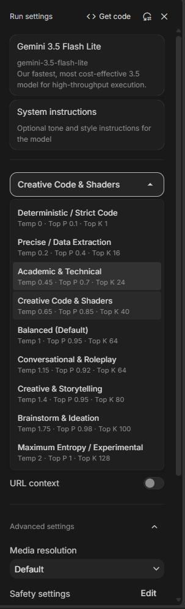
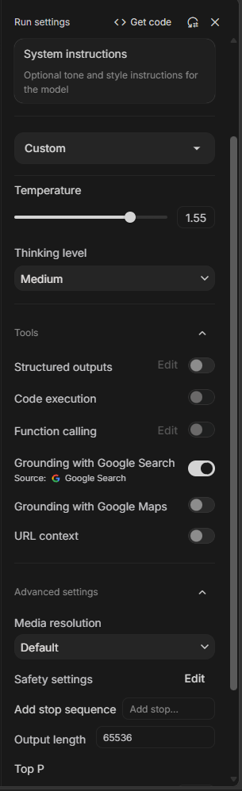
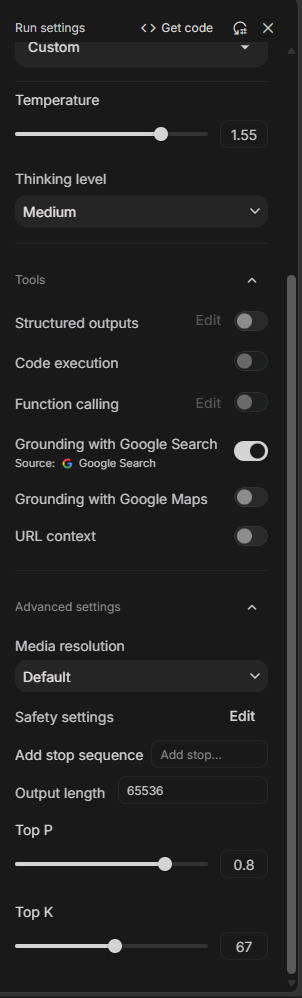

# AI Studio Pro Suite

<b>English</b>

### What is this?
**AI Studio Pro Suite** is a lightweight Chrome extension for [Google AI Studio](https://aistudio.google.com). 

It brings back missing generation sliders (`Temperature`, `Top P`, `Top K`) on models that hide them (such as Gemini Flash with Thinking), gives you 9 one-click sampling presets for coding, writing, and brainstorming, and seamlessly blends into the native Google UI with zero lag.

---

### Screenshots

| 1. One-Click Presets | 2. Native Temperature Slider | 3. Advanced Top P & Top K |
| :---: | :---: | :---: |
|  |  |  |
| *Clean preset picker right under model selection* | *Seamless slider for models that hide temperature* | *Guaranteed Top P & Top K in Advanced Settings* |

---

### Quick Presets

| Preset | Best For | Temp | Top P | Top K |
| :--- | :--- | :---: | :---: | :---: |
| **Deterministic / Strict Code** | Strict code, JSON schemas, unit tests | `0.00` | `0.10` | `1` |
| **Precise / Data Extraction** | Fact extraction, summarization, tables | `0.20` | `0.40` | `16` |
| **Academic & Technical** | Research papers, formal analysis | `0.45` | `0.70` | `24` |
| **Creative Code & Shaders** | Shaders, game logic, procedural math | `0.65` | `0.85` | `40` |
| **Balanced (Default)** | Daily work, general assistant, chat | `1.00` | `0.95` | `64` |
| **Conversational & Roleplay** | Interactive characters, long-form dialog | `1.15` | `0.92` | `64` |
| **Creative & Storytelling** | Fiction, novels, worldbuilding | `1.40` | `0.95` | `80` |
| **Brainstorm & Ideation** | Unconventional concepts, divergent ideas | `1.75` | `0.98` | `100` |
| **Maximum Entropy / Experimental**| Wild, chaotic, and artistic exploratory output | `2.00` | `1.00` | `128` |

---

### Quick Installation

1. Download or clone this repository.
2. Open Chrome and go to `chrome://extensions/`.
3. Enable **Developer mode** in the top-right corner.
4. Click **Load unpacked** and select the project folder.
5. Open [Google AI Studio](https://aistudio.google.com/) and enjoy!

---

### Under the Hood (Technical Highlights)
- **Zero Layout Jitter**: Elements are reconciled with DOM anchors without cyclic reflows or parent thrashing.
- **Strict CSP / Trusted Types**: Pure DOM node generation (`createElement`, `createTextNode`) — 0% `innerHTML`.
- **RPC Payload Hook**: Direct Protobuf/JSON injection via network hooks ensures parameters apply even when the native UI omits them.
- **Hardware Containment**: Utilizes CSS `content-visibility: auto` to maintain 60 FPS in long chat sessions.

<b>Русский</b>

### Что это такое?
**AI Studio Pro Suite** — легкое расширение для [Google AI Studio](https://aistudio.google.com). 

Оно возвращает скрытые разработчиками ползунки (`Temperature`, `Top P`, `Top K`) в моделях, где их принудительно отключили (например, Gemini Flash с Thinking), добавляет 9 готовых пресетов в один клик под разные задачи и выглядит точь-в-точь как родной интерфейс Google без лагов.

---

### Скриншоты

| 1. Выбор пресетов | 2. Ползунок Temperature | 3. Top P и Top K в Advanced |
| :---: | :---: | :---: |
|  |  |  |
| *Удобный выбор пресета под моделью* | *Родной дизайн для скрытых параметров* | *Гарантированные Top P и Top K в настройках* |

---

### Готовые пресеты

| Пресет | Для каких задач | Temp | Top P | Top K |
| :--- | :--- | :---: | :---: | :---: |
| **Deterministic / Strict Code** | Точный код, строгие JSON-схемы, тесты | `0.00` | `0.10` | `1` |
| **Precise / Data Extraction** | Извлечение фактов, парсинг данных | `0.20` | `0.40` | `16` |
| **Academic & Technical** | Документация, научные статьи | `0.45` | `0.70` | `24` |
| **Creative Code & Shaders** | Шейдеры, игровая логика, алгоритмы | `0.65` | `0.85` | `40` |
| **Balanced (Default)** | Повседневные диалоги, аналитика | `1.00` | `0.95` | `64` |
| **Conversational & Roleplay** | Ролевые игры, живые персонажи | `1.15` | `0.92` | `64` |
| **Creative & Storytelling** | Сценарии, книги, художественный текст | `1.40` | `0.95` | `80` |
| **Brainstorm & Ideation** | Нестандартные идеи, брейншторм | `1.75` | `0.98` | `100` |
| **Maximum Entropy / Experimental**| Максимальная случайность, поиск аномалий | `2.00` | `1.00` | `128` |

---

### Быстрая установка

1. Скачайте архив или склонируйте этот репозиторий.
2. Откройте Chrome и перейдите по адресу `chrome://extensions/`.
3. В правом верхнем углу включите **Режим разработчика** (Developer mode).
4. Нажмите **Загрузить распакованное** (Load unpacked) и выберите папку с файлами.
5. Откройте [Google AI Studio](https://aistudio.google.com/) — всё готово к работе!

---

### Технические особенности
- **Никаких дёрганий экрана**: Проверенное позиционирование элементов без циклических перерисовок (reflow).
- **Безопасность (Trusted Types CSP)**: Генерация только через нативные ноды (`createElement`, `createTextNode`) — 0% использования `innerHTML`.
- **Прямой перехват RPC**: Значения передаются напрямую в сетевой запрос Protobuf/JSON, даже если модель скрыла настройки из интерфейса.
- **Оптимизация рендера**: CSS-изоляция `content-visibility: auto` сохраняет плавность 60 FPS даже в огромных диалогах.

